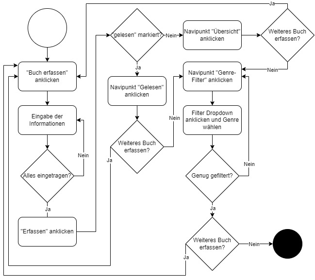

# Bücher-Datenbank
## Ausgangslage
Bei der Evaluation des Projektes hat sich der Projektverantwortliche mit diversen Themen beschäftigt. 
Nach Absprache mit dem Dozenten hat er sich für die Bücher-Datenbank entschieden. Bei der Bücher-Datenbank handelt sich um eine Datenbank, worin der Nutzer Bücher erfassen kann, welche er lesen möchte. Hier kann noch spezifisch das Genre und der Autor eingetragen werden, was zu einem späteren Zeitpunkt noch sinnvolle Funktionen ermöglichen kann. Zusätzlich soll die Funktion gegeben sein, dass gelesene Bücher markiert werden können. 
Die Datenbank soll dann die eingegebene Daten konsolidieren und diverse Übersichten und eine Filter-Funktion zur Verfügung stellen. Welche Funktionen zukünftig noch eingebaut werden können, sind im Kapitel erweiterte Funktionen beschrieben. 

***
## Funktion und Projektidee
Das Ziel ist die Erstellung einer Bücher-Datenbank. Folgende Funktionalitäten soll die Datenbank erfüllen:
* Erfassen von Bücher
* Erfassen von Autor und Genre
* Übersicht aller erfassten Bücher
* Die Filterung nach Genre
* Statistik über Anzahl Bücher pro Genre
* Markierung von gelesenen Bücher und Ausgabe in einer eigener Liste

***
## Erweiterte Funktion
Die folgenden Funktionen wurden im aktuellen Programm nicht eingebaut. Sie dienen lediglich als Idee für die zukünftige Weiterentwicklungen.
Dies wird im Verlauf vom Projekt noch gemeinsam mit dem Dozenten abgesprochen und bei gegebenem Fall umgesetzt.
#### Suchfunktion
Zukünftig kann eine Suchfunktion integriert werden, worin der Nutzer nach Genre, Autor oder dem Buchnamen suchen kann.
#### Vorschlagsfunktion
Auch kann das Programm in der Zukunft auch die Möglichkeit bieten, dem Nutzer passende Bücher zu vorschlagen. 
Die Vorschläge entstehen basierend auf gelesene Bücher, Autoren oder Genre. 

***
## Workflow
* Dateineingabe
* Datenverarbeitung
* Datenausgabe
* Flussdiagramm zu WebApp

***
# Flussdiagramm zu Webapp

***
# Selbstreflexion
Ich habe in meiner Laufbahn keine Jobs oder Ausbildungen im IT oder Programmierungsbereich gemacht. Die ersten Kenntnisse mit Python habe ich durch das Studium und dem Modul PROG1 gemacht und musste basierend dieser Kenntnisse mein aktuelles Projekt verwirklichen.
Dank den Inputs des Dozenten und dem Internet konnte ich auf informative und hilfreiche Unterstützung zählen, welche das Projekt realisieren liessen. Zu Beginn wusste ich nicht womit ich anfangen soll. Jedoch konnte ich in den Vorlesungen sehr viel lernen und diese Vorgehensvorschläge in meinem Projekt umsetzen. 
Nachdem ich die Verbindung zwischen dem main.py und die einzelnen html-Seiten verstanden habe, konnte ich die benötgten Seiten aufsetzen und mithilfe von Bootstrap auch optische Verbesserungen vornehmen. Danach ging es darum die Funktionen pro Unterseite zu programmieren. Es war nicht einfach, da immer wieder neue Hindernisse auftauchten. 
Dank dem Tutoring konnten die Knoten gelöst werden und am Ende eine funktionierende Seite realisiert werden. Eine der grössten Herausforderung hatte ich bei der Erstellung der Statistik mit Plotly. 
***
# FAQ